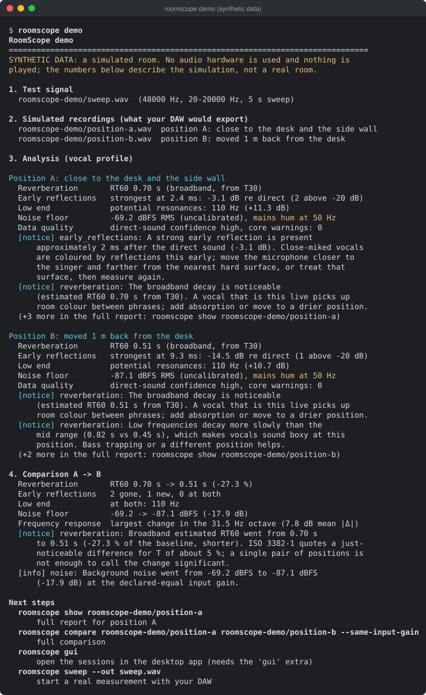
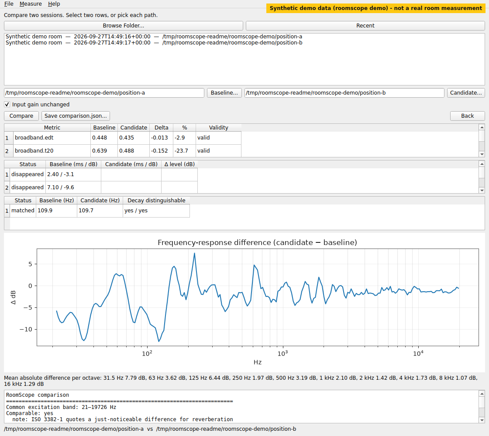
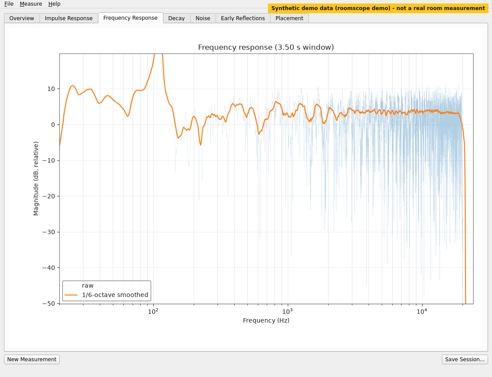

# RoomScope

**Open-source room acoustics analysis for recording engineers.**
Measure a room with your own DAW and audio interface, then see what a
microphone position is really picking up: reverberation (RT60), early
reflections, frequency response, noise floor and low-frequency resonances.
Compare two positions before you commit to a take.

[](https://github.com/jingyemingyue/RoomScope/actions/workflows/ci.yml)
[](LICENSE)
[](https://www.python.org/)
[](#supported-platforms)
[](docs/STATUS.md)

[中文说明](README.zh-CN.md) · [User guide](docs/user-guide/en.md) ·
[Try it without hardware](#try-it-in-60-seconds-no-audio-hardware) ·
[Help test on real hardware](docs/HARDWARE_TESTING.md)

> **Status: alpha.** The analysis runs end to end and the synthetic test suite
> passes on Linux, macOS and Windows. Real-world hardware validation is in
> progress: no interface or room result has been confirmed yet, and
> [testers are welcome](docs/HARDWARE_TESTING.md). Not on PyPI yet.

## What can RoomScope tell me?

* **Is this microphone position usable?** One report with the reverberation
  time, the strongest early reflection, the noise floor and any low-frequency
  build-up at that spot.
* **Are early reflections hurting the recording?** A desk or wall bounce a few
  milliseconds after the direct sound colours a close-miked vocal. RoomScope
  lists each reflection's delay and level.
* **Is the low end building up here?** Potential room resonances below 300 Hz,
  and whether low frequencies decay more slowly than the mids.
* **Is the room too reverberant for this source?** EDT, T20, T30 and an RT60
  estimate per octave band, read against a recording profile (vocal,
  voice-over, acoustic guitar, drums, room mic, choir).
* **Did moving the microphone actually help?** Compare two saved positions.
  Each change is reported only when both measurements are valid.

When the data is not good enough, RoomScope says so ("insufficient decay
range") instead of printing a plausible-looking number. There is no single
"room score".

## See it in action

All images below come from `roomscope demo`, a **synthetic demo** (a
simulated room, not a measurement).

<p align="center">
  
</p>

<details>
<summary><b>CLI: <code>roomscope demo</code></b> (terminal output, synthetic data)</summary>
<p align="center">
  
</p>
</details>

<details>
<summary><b>Compare two microphone positions</b> (desktop app, synthetic data)</summary>
<p align="center">
  
</p>
</details>

<details>
<summary><b>Frequency response</b> (desktop app, synthetic data)</summary>
<p align="center">
  
</p>
</details>

## Who it is for

* **Recording and mixing engineers** choosing where to put a microphone,
  a performer or a vocal booth.
* **Home- and project-studio owners** checking whether treatment changed
  anything measurable.
* **Podcasters and voice-over artists** looking for the quietest, driest spot
  in a room.
* **Audio-engineering and acoustics students** who want to see an impulse
  response, a decay curve and the numbers derived from them.
* **Developers** who want a scriptable measurement: every command can print
  JSON, and each saved result follows a published JSON Schema.

## Why RoomScope?

RoomScope is not trying to replace every acoustics tool. It is built for one
job: helping someone who records decide where to record.

* **DAW-independent.** It writes a test-signal WAV and reads the recording
  back. It works with any DAW that can play and record WAV files (Cubase,
  Pro Tools, Logic Pro, Studio One, Ableton Live, REAPER, FL Studio, Bitwig,
  ...). RoomScope never talks to the DAW, so your recording setup stays as it is.
* **Focused on recording decisions.** Reports are organised around
  microphone positions and comparisons, with advice worded for the kind of
  source you are recording.
* **Honest validity reporting.** Every number carries its unit, its method and
  a validity flag. Levels are dBFS unless you calibrate; nothing is presented
  as dB SPL.
* **Open and scriptable.** Apache-2.0, a CLI, a desktop app and a Python API
  that share one analysis pipeline.

How it relates to tools you may already use:

| Tool | What it is best at | Where RoomScope differs |
| --- | --- | --- |
| [REW (Room EQ Wizard)](https://www.roomeqwizard.com/) | A mature, free, full-featured measurement suite (measurement, EQ, many analysis views) | RoomScope is open source, narrower, and built around the DAW-as-recorder workflow and position comparison |
| [pyroomacoustics](https://github.com/LCAV/pyroomacoustics) | Simulating rooms and microphone arrays in Python | RoomScope measures real rooms from a recording; it does not simulate them |
| Spectrum analyzers / DAW plug-ins | Showing the spectrum of the signal playing right now | RoomScope measures the room's impulse response, decay and reflections, not just a signal's spectrum |

## Install

RoomScope needs **Python 3.12 or newer**. It is not on PyPI yet, so install it
from GitHub. `pip install roomscope` is **planned**; it does not work yet.

```bash
python3 -m venv roomscope-env
source roomscope-env/bin/activate          # Windows: roomscope-env\Scripts\activate
pip install "roomscope[gui] @ git+https://github.com/jingyemingyue/RoomScope.git"
roomscope --version
```

Drop `[gui]` for the command line only (the desktop app pulls in PySide6,
which is large). With [pipx](https://pipx.pypa.io/):
`pipx install git+https://github.com/jingyemingyue/RoomScope.git`.

On Linux, measuring directly through an interface (Standalone Mode) needs
PortAudio: `sudo apt install libportaudio2`.

**Development install** (to run the tests or change the code): see
[CONTRIBUTING.md](CONTRIBUTING.md).

**Desktop bundles.** The release workflow builds unsigned bundles for macOS,
Windows and Linux. None has been published yet; see
[Releases](https://github.com/jingyemingyue/RoomScope/releases) and
[docs/STATUS.md](docs/STATUS.md).

## Try it in 60 seconds (no audio hardware)

```bash
roomscope demo
```

The demo writes a sweep and two **simulated** recordings of the same made-up
room, one with the microphone close to a desk and a side wall and one moved
back from both. It analyses both and compares them. Everything lands in
`roomscope-demo/`, so you can continue with the real commands:

```bash
roomscope show roomscope-demo/position-a                     # full report
roomscope compare roomscope-demo/position-a roomscope-demo/position-b --same-input-gain
roomscope gui                                                # both sessions are in the Recent list
```

## Measure your room (Universal DAW Mode)

You need a loudspeaker (your monitors), a microphone (ideally an
omnidirectional measurement microphone) and any DAW.

```bash
# 1. Write the test signal (48 kHz, 20 Hz–20 kHz, 10 s sweep, -12 dBFS peak)
roomscope sweep --out sweep.wav

# 2. In your DAW: import sweep.wav, play it through the monitors (start quiet),
#    record the microphone on another track, export that track as recording.wav

# 3. Analyse it and save a session folder
roomscope analyze --recording recording.wav --sweep sweep.wav --out desk-position/ --profile vocal
```

The report starts with an **At a glance** block, followed by the details:

```text
At a glance
  Reverberation       RT60 0.70 s (broadband, from T30)
  Early reflections   strongest at 2.4 ms: -3.1 dB re direct (2 above -20 dB)
  Low end             potential resonances: 110 Hz (+11.3 dB)
  Noise floor         -69.2 dBFS RMS (uncalibrated), mains hum at 50 Hz
  Data quality        direct-sound confidence high, core warnings: 0
```

<sub>Values from the synthetic demo, position A.</sub>

No DAW handy? **Standalone Mode** plays and records through your interface
directly: `roomscope devices`, then
`roomscope measure --out desk-position/ --input-device <idx> --output-device <idx>`.
The default level is conservative and RoomScope never changes system volume.

## Compare positions

Measure a second position with the same sweep and the same input gain, then:

```bash
roomscope compare desk-position/ back-position/ --same-input-gain --out comparison.json
```

```text
At a glance
  Reverberation       RT60 0.70 s -> 0.51 s (-27.3 %)
  Early reflections   2 gone, 1 new, 0 at both
  Low end             at both: 110 Hz
  Noise floor         -69.2 -> -87.1 dBFS (-17.9 dB)
```

<sub>Synthetic demo, position A -> B.</sub>

A resonance found at both positions usually belongs to the room; a reflection
that disappears belonged to the position. For a whole room, group sessions in
a project and average them: `roomscope project init | add | average`.

## Desktop app

`roomscope gui` (or `roomscope-gui`) opens the desktop app: Universal DAW
Mode, Standalone Mode, a hardware-free Demo, results with plots (impulse
response, frequency response, decay, noise, reflections), Compare, and a
session browser. English and Simplified Chinese (`--lang zh_CN` or Settings).

## Supported platforms

| Platform | Automated tests (CI) | Real audio hardware |
| --- | --- | --- |
| Linux x86_64 | Python 3.12, 3.13, 3.14 | Not tested yet |
| macOS 13+ | Python 3.12 | Not tested yet |
| Windows 10/11 x64 | Python 3.12 | Not tested yet |

Anything else may work but is not tested. Have an interface and ten minutes?
The [hardware testing guide](docs/HARDWARE_TESTING.md) says what to run and
how to report it.

## Current limitations

* **No confirmed hardware results yet.** Synthetic tests pass; real-world
  validation is in progress ([HARDWARE_TESTING.md](docs/HARDWARE_TESTING.md),
  [VALIDATION.md](docs/VALIDATION.md)).
* **Not on PyPI, no published release yet.** Desktop bundles are unsigned
  (macOS Gatekeeper / Windows SmartScreen will warn).
* **Levels are digital (dBFS)** unless you supply a calibration. RoomScope
  never reports dB SPL from an uncalibrated microphone.
* **One microphone position cannot locate walls.** Reflections come with
  delays and path lengths; with two tape measurements RoomScope derives
  vertical heights, but never room dimensions or which wall caused a reflection.
* **Not a room simulator, not an EQ or room-correction tool, not a real-time
  analyzer.**
* **Before 1.0** the Python API and the JSON schemas may still change.

## Python API

```python
from roomscope import analyze
from roomscope.io.wav import read_wav, load_reference

result = analyze(read_wav("recording.wav"), load_reference("sweep.wav"))
print(result.decay.broadband.rt60_estimate_s, result.decay.broadband.rt60_basis)
for r in result.reflections.reflections:
    print(f"{r.delay_ms:.1f} ms  {r.relative_db:.1f} dB")
```

## Technical details

* **Measurement:** exponential sine sweep (Farina 2000) and deconvolution to
  the room impulse response; the sweep is found automatically in an untrimmed
  recording. Optional electrical loopback compensates the interface latency
  and response.
* **Reverberation:** Schroeder backward integration with Lundeby noise
  truncation, EDT / T20 / T30 per octave band (ISO 3382-1/-2 definitions),
  curvature and filter-ringing checks. RT60 is only ever estimated from a
  VALID metric.
* **Everything else:** smoothed frequency response, background-noise level
  and mains-hum detection, early-reflection search, low-frequency resonance
  candidates with decay-vs-filter-ringing checks, optional vertical placement
  geometry, recording profiles, spatial averaging with ISO 3382-2 classes.
* **Outputs:** `result.json`, `session.json`, `comparison.json` (each with a
  shipped JSON Schema: `roomscope schema result`), the impulse response as a
  float WAV, CSV export, and zipped session bundles for bug reports.

Every algorithm, unit, validity rule and reference is in
[docs/MEASUREMENT_METHODOLOGY.md](docs/MEASUREMENT_METHODOLOGY.md).
The package layout and extension points are in
[docs/ARCHITECTURE.md](docs/ARCHITECTURE.md).

## Documentation

| Document | For |
| --- | --- |
| [User guide](docs/user-guide/en.md) · [用户指南](docs/user-guide/zh-CN.md) | Measuring, reading results, comparing, troubleshooting |
| [Hardware testing](docs/HARDWARE_TESTING.md) | Trying RoomScope on your interface and reporting the result |
| [Measurement methodology](docs/MEASUREMENT_METHODOLOGY.md) | Algorithms, units, validity rules, references |
| [Status](docs/STATUS.md) · [Changelog](CHANGELOG.md) | What works, what was verified, what changed |
| [Documentation hub](docs/index.md) | Architecture, release plan, dependencies, licences |

## Contributing

Bug reports, hardware test reports, DAW-specific notes and pull requests are
all welcome. Start with [CONTRIBUTING.md](CONTRIBUTING.md) (setup, tests and
what a good pull request looks like) and the
[code of conduct](CODE_OF_CONDUCT.md). Security issues go through
[SECURITY.md](SECURITY.md).

## License

Apache License 2.0; see [LICENSE](LICENSE) and [NOTICE](NOTICE). The desktop
app uses Qt through PySide6 under the LGPL-3.0; every dependency is listed in
[docs/DEPENDENCIES.md](docs/DEPENDENCIES.md).
