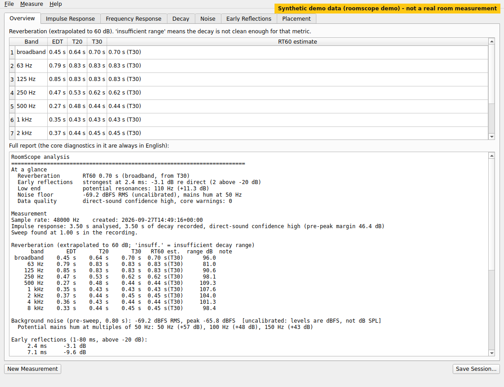

# RoomScope

**面向录音师的开源房间声学分析工具。**
用你自己的 DAW 和声卡测量房间，看清某个话筒位置实际拾到了什么：混响时间（RT60）、
早期反射、频率响应、本底噪声和低频共振。在正式录音之前，对比两个位置哪个更好。

[](https://github.com/jingyemingyue/RoomScope/actions/workflows/ci.yml)
[](LICENSE)
[](https://www.python.org/)

[English](README.md) · [用户指南](docs/user-guide/zh-CN.md) ·
[参与真实硬件测试](docs/HARDWARE_TESTING.md)

> **状态：Alpha（v0.4.1）。** 完整的分析流程可以跑通，合成信号测试在 Linux、macOS、
> Windows 上全部通过。真实硬件验证正在进行中：目前还没有任何一款声卡或房间的结果
> 被确认，[欢迎参与测试](docs/HARDWARE_TESTING.md)。尚未发布到 PyPI。

## RoomScope 能回答什么问题？

* **这个话筒位置能用吗？** 一份报告给出该位置的混响时间、最强的早期反射、本底噪声和低频堆积。
* **早期反射是否在伤害录音？** 桌面或墙面在直达声之后几毫秒的反射会给近距离人声染色；
  RoomScope 列出每条反射的延迟和电平。
* **这里低频是否堆积？** 列出 300 Hz 以下可能的房间共振，以及低频是否比中频衰减更慢。
* **对这种音源来说房间是否太“活”？** 按倍频程给出 EDT、T20、T30 和 RT60 估计，
  并按录音配置（人声、配音、原声吉他、鼓、房间话筒、合唱）解读。
* **挪动话筒后真的变好了吗？** 对比两个已保存的位置；只有两次测量都有效（VALID）时才给出变化量。

数据不够好时，RoomScope 会明确说“衰减范围不足”，而不是编一个看起来合理的数字。
没有所谓的“房间评分”。

## 效果展示

下面的图片全部来自 `roomscope demo`，是**合成演示数据**（模拟房间，不是真实测量）。

<p align="center">
  
</p>

命令行演示（终端输出）见 [docs/assets/cli-demo.svg](docs/assets/cli-demo.svg)，
位置对比见 [docs/assets/gui-compare.png](docs/assets/gui-compare.png)。

## 为什么是 RoomScope？

RoomScope 并不打算替代所有声学工具，它只专注一件事：帮录音的人决定在哪里录。

* **不依赖 DAW。** 它生成测试信号 WAV，再读回录音 WAV。任何能播放和录制 WAV 的 DAW
  都可以用（Cubase、Pro Tools、Logic Pro、Studio One、Ableton Live、REAPER、FL Studio 等）。
  RoomScope 从不与 DAW 通信，你的录音工作流保持不变。
* **围绕录音决策。** 报告以话筒位置和对比为中心，建议按音源类型措辞。
* **如实报告有效性。** 每个数字都带单位、方法和有效性标记。未校准时电平是 dBFS，从不冒充 dB SPL。
* **开源、可脚本化。** Apache-2.0；命令行、桌面程序和 Python API 共用同一条分析管线。

与常见工具的关系：REW（Room EQ Wizard）是成熟、免费、功能全面的测量套件；
pyroomacoustics 用于房间与阵列**仿真**；频谱分析插件显示的是正在播放的信号频谱。
RoomScope 是开源的、范围更窄的工具，专注于“DAW 作为录音机”的流程和话筒位置对比。

## 安装

需要 **Python 3.12 或更高版本**。目前尚未发布到 PyPI，请从 GitHub 安装
（`pip install roomscope` 是**计划中**的功能，现在还不能用）：

```bash
python3 -m venv roomscope-env
source roomscope-env/bin/activate          # Windows: roomscope-env\Scripts\activate
pip install "roomscope[gui] @ git+https://github.com/jingyemingyue/RoomScope.git"
roomscope --version
```

只要命令行可以去掉 `[gui]`（桌面程序依赖较大的 PySide6）。Linux 上的独立模式需要
PortAudio：`sudo apt install libportaudio2`。开发安装见 [CONTRIBUTING.md](CONTRIBUTING.md)。

## 60 秒试用（无需任何音频硬件）

```bash
roomscope --lang zh_CN demo
```

演示会生成扫频信号和同一个模拟房间里两个位置的**模拟录音**（一个靠近桌面和侧墙，
一个向后移开），分别分析并对比。所有文件都在 `roomscope-demo/` 中，可以继续用真实命令查看：

```bash
roomscope --lang zh_CN show roomscope-demo/position-a
roomscope --lang zh_CN compare roomscope-demo/position-a roomscope-demo/position-b --same-input-gain
roomscope gui
```

## 测量你的房间（通用 DAW 模式）

```bash
# 1. 生成测试信号（48 kHz，20 Hz–20 kHz，10 s 扫频，峰值 -12 dBFS）
roomscope sweep --out sweep.wav
# 2. 在 DAW 中导入 sweep.wav，从监听音箱播放（先调小音量），
#    在另一条音轨录制话筒，并把该音轨导出为 recording.wav
# 3. 分析并保存会话
roomscope --lang zh_CN analyze --recording recording.wav --sweep sweep.wav --out desk/ --profile vocal
```

再测一个位置（相同扫频、相同输入增益）后对比：

```bash
roomscope --lang zh_CN compare desk/ back/ --same-input-gain
```

## 支持的平台

| 平台 | 自动化测试（CI） | 真实音频硬件 |
| --- | --- | --- |
| Linux x86_64 | Python 3.12、3.13、3.14 | 尚未测试 |
| macOS 13+ | Python 3.12 | 尚未测试 |
| Windows 10/11 x64 | Python 3.12 | 尚未测试 |

## 当前限制

* **还没有经过确认的硬件结果。** 合成测试通过；真实环境验证进行中。
* **尚未发布到 PyPI，也没有正式 Release。** 桌面安装包未签名。
* **电平为数字电平（dBFS）**，除非提供校准；未校准时从不报告 dB SPL。
* **单个话筒位置无法定位墙面。** 可以给出反射延迟和路径长度，但不给出房间尺寸或“哪面墙”。
* **不是房间仿真器，不是 EQ / 房间校正工具，也不是实时分析仪。**

## 参与

欢迎提交缺陷报告、硬件测试报告、特定 DAW 的使用说明和 Pull Request。
请先阅读 [CONTRIBUTING.md](CONTRIBUTING.md) 与 [硬件测试指南](docs/HARDWARE_TESTING.md)。

## 许可证

Apache License 2.0，见 [LICENSE](LICENSE) 与 [NOTICE](NOTICE)。
